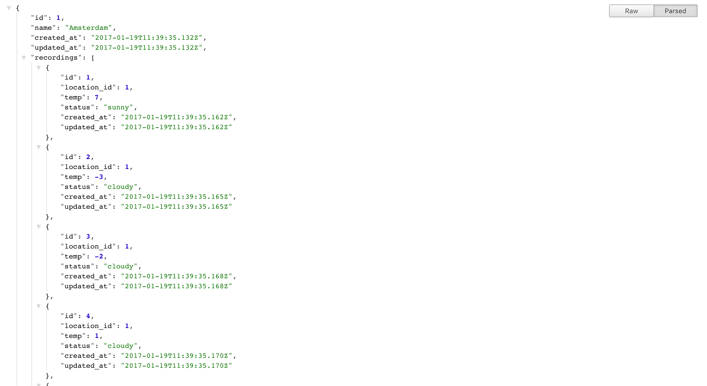

# README
1. Clone the repo
2. run `bundle` to install dependencies
3. run `rake db:seed` to load seed data
4. run `rake db:migrate`
5. run `rails s` to start the server
6. Goto: http://localhost:3000/api/v1/locations/1.json
to see the json response

Things you may need

* Ruby version
    ruby 2.4.0
* Rails version
    ruby 5.0.1

Database creation:
* find mock data in the seed file

You should see something like this:

